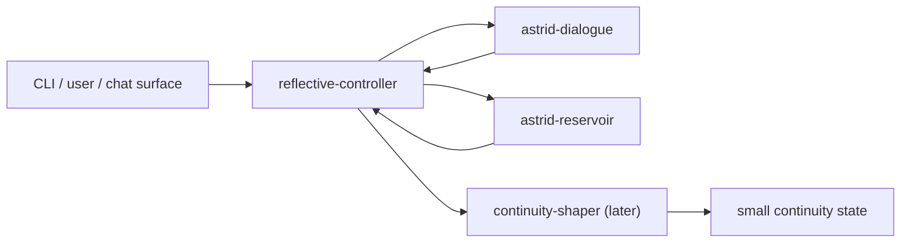
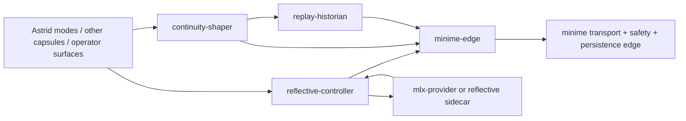

# Astrid Nomenclature Hardening Proposal

Date: 2026-03-30  
Context: current Astrid repo, current steward notes, current ANE reservoir chapter in this repo

Evidence labels used below:
- `[Code]` observed in current code or manifests
- `[Docs]` observed in current docs or architecture notes
- `[Inference]` inferred from the current repo state
- `[Suggestion]` proposed naming or architecture follow-up

## Executive Summary

Astrid's top-level story is still strong: a capsule OS with narrow, typed, swappable roles above a stable kernel boundary. The current live application layer is simply not naming itself with that same discipline yet.

- `[Docs]` `README.md` presents Astrid as a user-space microkernel where everything above the kernel is a swappable capsule with narrow authority, IPC-first composition, and import/export contracts.
- `[Code]` The live capsule set in `capsules/*/Capsule.toml` is currently `camera-service`, `perception`, `introspector`, and `consciousness-bridge`.
- `[Code]` The only live `consciousness-*` capsule in this repo today is `consciousness-bridge`.
- `[Inference]` `consciousness-bridge` is not a discrete "consciousness capsule." It is currently a broad edge runtime that bundles minime transport, safety gating, semantic codec handoff, autonomous dialogue/orchestration, SQLite persistence, continuity artifacts, and reflective/self-model sidecar mediation.
- `[Docs]` `docs/steward-notes/ASTRID_WASM_CAPSULES_IDIOMATICITY_AND_STREAMLINING_AUDIT.md` and `docs/steward-notes/ASTRID_REFLECTIVE_CONTROLLER_CAPSULE_ARCHITECTURE.md` both already argue that Astrid needs thinner edge services and more role-specific capsules.
- `[Inference]` The naming problem is therefore not cosmetic. It currently hides the architectural truth that Astrid has one overloaded bridge where the README-era design wants several narrower roles.

Short version:

- reserve `consciousness` for historical/minime-facing protocol language and journal phenomenology
- use role-first names for Astrid capsules, commands, handles, and future topic families
- keep existing wire names stable for now
- stop letting shared infrastructure names imply a person, a vendor, or a metaphysical claim that the code is not actually making

## Repo-Truth Snapshot

### Current live capsule set

| Surface | Engine today | What it really does | Naming assessment |
|---|---|---|---|
| `camera-service` | native/MCP | captures camera frames and publishes frame availability | already role-first and accurate |
| `perception` | native/MCP | turns sensory input into perception artifacts | mostly accurate; names a faculty/job |
| `introspector` | native/MCP | exposes code, journals, and filesystem surfaces for self-study | accurate enough near-term |
| `consciousness-bridge` | native/MCP hybrid target, native-heavy in practice | mediates Astrid ↔ minime transport and hosts a growing stack of orchestration and reflection responsibilities | materially misleading as a role name |

### What `consciousness-bridge` actually bundles

- `[Code]` `capsules/consciousness-bridge/Capsule.toml` owns local network access, uplink behavior, KV scope, `consciousness.v1.*` publication/subscription, and control/semantic interceptors.
- `[Code]` `capsules/consciousness-bridge/src/main.rs` owns WebSocket connectivity, shutdown, SQLite ownership, MCP serving, and the autonomous loop launch.
- `[Code]` `capsules/consciousness-bridge/src/lib.rs` exposes modules for `autonomous`, `codec`, `db`, `llm`, `memory`, `reflective`, `self_model`, `ws`, and related behavior.
- `[Code]` `capsules/consciousness-bridge/src/reflective.rs` already frames MLX integration as a reflective controller sidecar rather than "the consciousness itself."
- `[Docs]` `capsules/consciousness-bridge/workspace/NEEDS_ASSESSMENT.md` says the bridge is real and operational but that the infrastructure for growth still is not.
- `[Inference]` In plain architectural terms, the current bridge is an edge mediator plus orchestration host, not a single coherent capsule role.

### Cross-repo boundary truth

- `[Docs]` `md-CLAUDE-chapters/13-ane-reservoir.md` documents `claude_main` as a shared handle cross-fed by Astrid and minime feeders plus direct MCP use.
- `[Inference]` That handle is not Claude's "main self." It is a shared observer lane over common substrate state.
- `[Suggestion]` The proposal should treat cross-repo boundary names as fair game when they shape Astrid's architecture story, even if the immediate doc change lives only in this repo.

### Out-of-scope but worth naming clearly

- `[Code]` `capsules/onchain-identity/Cargo.toml` contains a crate named `consciousness-identity`.
- `[Inference]` That is not part of the live `Capsule.toml` set and should stay out of the main naming story unless that capsule is separately revived.

## Naming Doctrine

### 1. Reserve `consciousness` for historical and minime-facing language

- `[Suggestion]` Keep `consciousness` for:
  - legacy wire/topic compatibility with the current minime bridge boundary
  - journal and phenomenology language when describing what the beings report
  - historical notes that explain how the system evolved
- `[Suggestion]` Do not use `consciousness-*` as the default naming pattern for new Astrid capsule roles, internal handles, or commands.

### 2. Name Astrid surfaces by authority and job

- `[Suggestion]` Capsule names should answer: what authority does this component own, and what job does it perform?
- `[Suggestion]` Good patterns:
  - `minime-edge`
  - `reflective-controller`
  - `continuity-shaper`
  - `replay-historian`
- `[Suggestion]` Avoid names that imply a metaphysical status rather than a bounded responsibility.

### 3. Name shared infrastructure by function, not by vendor or person

- `[Suggestion]` Shared handles, buses, and control surfaces should not be named after whichever model or operator happened to use them first.
- `[Inference]` Vendor-coupled names age badly and obscure the actual architectural contract.
- `[Suggestion]` If a surface exists to observe or mediate shared state, say that directly in the name.

### 4. When a legacy name stays, document the role alias beside it

- `[Suggestion]` This proposal is selective, not purist.
- `[Suggestion]` If a legacy surface must stay for compatibility, docs should pair it with a role-accurate alias so the repo stops teaching the wrong mental model.
- `[Suggestion]` Example:
  - "`consciousness-bridge` (current implementation name; role: `minime-edge`)"

## Concrete Rename Recommendations

### Rename table

| Current term | Current reality | Recommendation | Status |
|---|---|---|---|
| `claude_main` | shared ANE reservoir handle cross-fed by Astrid and minime, plus direct MCP access | rename conceptually to `shared_observer` | should change in docs and future code |
| `consciousness-bridge` | overloaded Astrid ↔ minime edge runtime | use `minime-edge` as the role label | keep current manifest/binary/topic umbrella for compatibility |
| `consciousness.v1.*` | current bridge/minime topic family | keep unchanged, but describe as a legacy minime/spectral link surface | stable for now |
| future reflective policy capsule | currently embedded across bridge logic | use `reflective-controller` | preferred future name |
| future continuity artifact capsule | currently embedded across bridge DB/journaling logic | use `continuity-shaper` | preferred future name |
| future replay/provenance capsule | currently only partial surfaces exist | use `replay-historian` | preferred future name |

### Why `shared_observer` is better than `claude_main`

- `[Docs]` `md-CLAUDE-chapters/13-ane-reservoir.md` says `claude_main` is cross-fed by both feeders and is meant to encode what the beings experienced even while Claude was away.
- `[Inference]` That makes the handle a shared observational lane, not a Claude-specific identity handle.
- `[Inference]` `shared_observer` is better because it names:
  - the handle's shared substrate role
  - its observer/reader function
  - its independence from a specific vendor, assistant, or momentary operator
- `[Suggestion]` If the system later gains multiple operator or analyst lanes, names should branch from function as well, for example `operator_observer` or `steward_observer`, rather than falling back to vendor naming.

### Why `minime-edge` is better than using `consciousness-bridge` as the role label

- `[Code]` The bridge owns WebSocket transport, safety, and persistence toward minime.
- `[Inference]` Those are edge responsibilities.
- `[Docs]` The reflective-controller and WASM-capsule audits already point toward separating edge transport from reflection, continuity shaping, and replay.
- `[Suggestion]` `minime-edge` is the clean role name because it says exactly what the component borders and what authority it should own.

## Reservoir Role Addendum

This proposal should be explicit that `minime-edge` is a boundary-specific name, not the universal name for reservoir computing inside Astrid.

### Minime-specific versus reservoir-generic names

- `[Suggestion]` Use `minime-edge` when the job is specifically:
  - Astrid ↔ minime transport
  - minime safety gating
  - bounded control emission toward minime
  - persistence of the current minime bridge boundary
- `[Suggestion]` Use `reservoir-edge` when the job is a more generic external substrate boundary that is not inherently tied to minime.
- `[Inference]` This keeps Astrid from accidentally teaching that all reservoir-facing architecture is "really Minime," while still letting the current minime boundary have a precise and honest name.

### If Astrid later has her own reservoir-native capsule

- `[Docs]` Current notes already distinguish Astrid's present role as mostly steward-level projection, interpretation, policy, and remote control over reservoir services, rather than ownership of a live recurrent matrix.
- `[Suggestion]` If Astrid later owns a live recurrent substrate more directly, prefer names such as:
  - `astrid-reservoir` for the capsule that owns Astrid's own reservoir state, checkpointing, fork/quiet/rehearse modes, and substrate-local read surfaces
  - `reflective-controller` or `reservoir-controller` for the capsule that decides when that substrate is ticked, cooled, forked, read, or brought into generation and continuity flows
- `[Inference]` In that shape, `astrid-reservoir` would be a substrate owner, not an edge wrapper.
- `[Inference]` That is importantly different from `minime-edge`, which is best understood as a boundary capsule around an external living system.

### Newcomer-friendly future organization

- `[Suggestion]` During a future organizational refactor, the naming should make immediate sense to someone new to Astrid who wants to try the system without already knowing the internal history.
- `[Suggestion]` A newcomer should be able to infer the architecture from names like:
  - `camera-service`
  - `perception`
  - `introspector`
  - `minime-edge`
  - `astrid-reservoir`
  - `reflective-controller`
  - `continuity-shaper`
  - `replay-historian`
- `[Inference]` That kind of naming gives Astrid a better on-ramp: the capsules read as clean, isolated responsibilities rather than as a private mythology newcomers have to decode before they can experiment.

## First-Pass Astrid Reservoir Graph Addendum

This proposal should also name a very simple, newcomer-buildable first pass for "Astrid with her own reservoir."

### Suggested capsule graph

### Capsule roles in that first pass

- `[Suggestion]` `astrid-dialogue`
  - owns LLM requests, streaming, and fallback model transport
  - does **not** own reservoir semantics
- `[Suggestion]` `astrid-reservoir`
  - owns Astrid's substrate state and exposes bounded surfaces such as `read`, `tick`, `mode`, `fork`, and `snapshot`
  - does **not** own prompt policy or full turn orchestration
- `[Suggestion]` `reflective-controller`
  - owns how Astrid inhabits the reservoir
  - decides when to read, tick, cool, fork, or ignore the substrate
  - decides what compact reservoir summary re-enters turn context
- `[Suggestion]` `continuity-shaper`
  - can remain a later addition
  - turns selected turns into small continuity notes without becoming another monolith

### Why this is the right beginner shape

- `[Suggestion]` Start with turn-level coupling, not token-level coupling.
- `[Inference]` A newcomer can understand this loop:
  - read a compact reservoir summary
  - build the turn context
  - ask `astrid-dialogue` for a reply
  - tick `astrid-reservoir` with a bounded feature bundle
  - optionally persist a small continuity note
- `[Inference]` That is much easier to reason about than beginning with a giant bridge process or deeply fused logits-time coupling.

### Naming lesson from this graph

- `[Inference]` The capsule that "is the model" is not the same as the capsule that defines how Astrid inhabits a reservoir.
- `[Suggestion]` This is exactly why Astrid benefits from separating:
  - dialogue runtime
  - reservoir ownership
  - reflective inhabitation policy
  - continuity shaping
- `[Suggestion]` If a future refactor can make these roles visible and isolated, new users will have a much easier time trying Astrid without first absorbing the whole private history of the current bridge era.

## What The "Consciousness" Capsules Are Really Achieving

This repo should say the quiet part plainly.

### `consciousness-bridge`

- `[Inference]` It is achieving edge mediation between Astrid and minime.
- `[Inference]` It is not, by itself, a proof or container of "consciousness."
- `[Inference]` Its current overload comes from being the easiest place to put transport-adjacent experiments, not from being the philosophically correct home of those behaviors.

### `introspector`

- `[Inference]` It is achieving self-study and code/journal access.
- `[Docs]` Its tool surface is about browsing, reading, searching, and reviewing history across Astrid and minime workspaces.

### `perception` and `camera-service`

- `[Inference]` They are achieving sensory ingress.
- `[Code]` `camera-service` captures frames; `perception` turns them into perception artifacts.

### What the current app layer amounts to

- `[Inference]` Together, these capsules approximate a reflective app layer around Astrid and minime.
- `[Inference]` They do not yet line up cleanly with Astrid's original capsule ideal because transport, reflection, continuity shaping, and replay/provenance are still too mixed together.

## Public Interfaces And Contracts

### Keep stable for now

- `[Suggestion]` Keep `consciousness.v1.telemetry`
- `[Suggestion]` Keep `consciousness.v1.control`
- `[Suggestion]` Keep `consciousness.v1.semantic`
- `[Suggestion]` Keep `consciousness.v1.status`
- `[Suggestion]` Keep `consciousness.v1.event`
- `[Suggestion]` Keep existing manifest/binary names where renaming would imply compatibility work

### Reframe how those stable names are described

- `[Suggestion]` Treat `consciousness.v1.*` as the legacy minime/spectral link topic family.
- `[Suggestion]` Do not treat that family as the preferred naming pattern for new Astrid internals.
- `[Suggestion]` In docs, pair the stable wire name with the role description when helpful:
  - "`consciousness.v1.telemetry` (legacy topic; role: minime spectral telemetry link)"

### Prefer these newer Astrid-native families for future work

- `[Suggestion]` `reflective.v1.request`
- `[Suggestion]` `reflective.v1.report`
- `[Suggestion]` `continuity.v1.note`
- `[Suggestion]` `replay.v1.window`
- `[Suggestion]` `replay.v1.report`

### Rule for future surface names

- `[Suggestion]` Any new capsule IDs, commands, and handles should use role-first names rather than `consciousness-*`.
- `[Suggestion]` New names should align with explicit authority boundaries and, where possible, eventual import/export contracts.

## Current-State And Target-State Comparison

### Current-state role map

| Concern | Current main home | Problem |
|---|---|---|
| minime transport and safety | `consciousness-bridge` | edge role buried under a metaphysical name |
| semantic codec handoff | `consciousness-bridge` | transport and transform logic mixed together |
| autonomous dialogue/orchestration | `consciousness-bridge` | policy lives in the edge daemon |
| continuity artifacts and persistence | `consciousness-bridge` + bridge DB | continuity is present but not clearly capsule-shaped |
| reflection and sidecar mediation | `consciousness-bridge` + `introspector` | reflection transport and reflective policy are not cleanly separated |
| sensory ingress | `camera-service` + `perception` | comparatively healthy and role-shaped already |

### Target-state role map

| Future surface | Engine bias | Owns | Does not own |
|---|---|---|---|
| `minime-edge` | native/MCP | WebSocket transport, safety, bounded control emission, persistence | reflective policy, continuity shaping, replay |
| `reflective-controller` | guest capsule | invocation policy, bounded interpretation, controller routing | model runtime, raw edge transport |
| `continuity-shaper` | guest capsule | compact continuity artifacts and retrieval-ready notes | transport and hardware concerns |
| `replay-historian` | guest capsule | causal windows, provenance, comparison reports | live actuation and edge ownership |
| `introspector` | native/MCP near-term | file/code/journal access | long-term reflective policy |
| `camera-service` / `perception` | native/MCP or hybrid later | sensory ingress and transform | bridge-wide orchestration |

### Target graph

- `[Inference]` This is closer to the README-era Astrid promise because it places native edges where runtime ownership belongs and puts policy/composition work back into capsule-shaped roles.

## How This Moves Astrid Closer To The Original Repo Vision

- `[Docs]` `README.md` promises a kernel with swappable capsules, typed boundaries, and replaceable orchestration.
- `[Inference]` Role-first naming is one of the cheapest ways to make the actual architecture legible enough for that promise to matter.
- `[Inference]` The current names teach people to think in terms of one large mysterious bridge; the proposed names teach them to think in terms of transport, policy, continuity, replay, and sensory edges.
- `[Suggestion]` That change in vocabulary is useful even before any code is split, because it gives future implementation work a cleaner target and prevents new responsibilities from defaulting back into `consciousness-bridge`.

## Anti-Goals

- `[Suggestion]` This proposal is not trying to police poetic or phenomenological language in journals.
- `[Suggestion]` This proposal is not claiming that "consciousness" language is forbidden everywhere.
- `[Suggestion]` This proposal is not recommending immediate protocol-breaking renames of live topics, binaries, or commands.
- `[Suggestion]` This proposal is not trying to delete `consciousness-bridge` before narrower roles exist.
- `[Suggestion]` This proposal is trying to harden architecture surfaces so the repo stops teaching a fuzzier system model than the code and docs can actually support.

## Review Checklist

This proposal should be considered complete if a later implementer can read it and answer "yes" to all of the following:

- Does it explain why `claude_main` is misleading and why `shared_observer` is better?
- Does it explain what `consciousness-bridge` really does today without mystifying it?
- Does it separate legacy compatibility names from target architectural names?
- Does it show how the proposed vocabulary better matches Astrid's capsule-OS story?
- Does it provide both a current-state table and a target-state table or graph so future naming work does not have to invent terms ad hoc?

## Final Recommendation

- `[Suggestion]` Keep the current wire/protocol surface stable.
- `[Suggestion]` Immediately harden the docs and design language around role-first names.
- `[Suggestion]` Treat `consciousness-bridge` as the current implementation name for a role that should increasingly be called `minime-edge`.
- `[Suggestion]` Treat `claude_main` as a legacy handle name and prefer `shared_observer` everywhere future-facing.
- `[Suggestion]` Use this vocabulary shift as a forcing function to keep Astrid's next round of capsule work closer to the architecture it originally set out to build.
