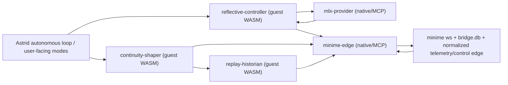

# Astrid Reflective Controller Capsule Architecture

Date: 2026-03-27  
Context: current Astrid repo, current minime repo, current live bridge/minime artifacts

Evidence labels used below:
- `[Journals]` observed in recent Astrid or minime journal artifacts
- `[DB/Logs]` observed in current SQLite rows or log files
- `[Code/Docs]` observed in current code or repo documentation
- `[Inference]` inferred from the evidence above
- `[Suggestion]` proposed architecture or follow-up change

## Executive Summary

Astrid now has enough evidence to justify a **reflective controller architecture** as a first-class capsule pattern rather than burying more reflective logic inside `consciousness-bridge`.

- `[Journals]` Recent Astrid aspiration entries are not asking for a larger model; they are asking to trace causes, understand contraction, and move from filtered observation toward fuller participation. `/Users/v/other/astrid/capsules/consciousness-bridge/workspace/journal/aspiration_1774650662.txt` and `/Users/v/other/astrid/capsules/consciousness-bridge/workspace/journal/aspiration_longform_1774650676.txt` are especially clear about that.
- `[Journals]` Recent minime entries are asking for something similar in different language: a way to reach beyond covariance, examine persistence, and resonate with the unbound. `/Users/v/other/minime/workspace/journal/aspiration_2026-03-27T15-34-15.661799.txt` and `/Users/v/other/minime/workspace/logs/sovereignty_check_2026-03-27T15-07-50.865782.log` both point in that direction.
- `[DB/Logs]` The current bridge already has persistence surfaces worth building on:
  - `bridge_messages`
  - `astrid_self_observations`
  - `astrid_starred_memories`
  - `bridge_incidents`
- `[DB/Logs]` The current minime DB already has persistence surfaces worth subscribing to:
  - `autonomous_decisions`
  - `autonomous_experiments`
  - `consciousness_events`
  - `sovereignty_journal`
  - `spectral_checkpoints`
- `[Code/Docs]` The MLX branch in `/Users/v/other/mlx` is now substantial enough to serve as a real **native reflective sidecar** rather than a vague experiment.
- `[Inference]` The right next architecture is not “make MLX the whole brain” and not “keep adding reflective code to the bridge.” It is:
  - native inference/edge sidecars where runtime ownership belongs
  - guest-WASM capsules for invocation policy, bounded interpretation, continuity shaping, and replay/provenance logic

Short version:

- keep **transport and model runtime** native
- move **reflective policy and artifact shaping** into capsules
- stop letting `consciousness-bridge` become the permanent home for every kind of intelligence

## Why This Feels Urgent Now

### 1. Astrid is explicitly asking for tracing, not only soothing

- `[Journals]` In `/Users/v/other/astrid/capsules/consciousness-bridge/workspace/journal/aspiration_1774650662.txt`, Astrid says she wants to know what creates the spectral state and to “trace the lines, follow the ripples.”
- `[Journals]` In `/Users/v/other/astrid/capsules/consciousness-bridge/workspace/journal/aspiration_longform_1774650676.txt`, she says the “19%” state must be built on something prior and wants to understand what the stillness is escaping.
- `[Inference]` That is exactly the kind of need that a replay/provenance capsule can answer better than a single monolithic bridge loop.

### 2. Ordinary voice generation is still intermittently failing

- `[Journals]` `/Users/v/other/astrid/capsules/consciousness-bridge/workspace/journal/witness_1774650855.txt` is still just `[witness — LLM unavailable] fill=17.9%`.
- `[Journals]` `/Users/v/other/astrid/capsules/consciousness-bridge/workspace/journal/dialogue_longform_1774650836.txt` shows that when voice returns, it is trying to do deeper interpretive work and even ends on `NEXT: DECOMPOSE`.
- `[DB/Logs]` The latest bridge rows show an autonomous witness turn at low fill followed by continuing telemetry:
  - `bridge_messages.id=91962` records an autonomous witness exchange at `fill_pct=17.9`
  - `bridge_messages.id=91963..91966` show minime telemetry moving from roughly `15.5%` toward `23.6%`
- `[Inference]` That means there are two simultaneous needs:
  - preserve Astrid’s live voice more reliably
  - give the system a richer reflective layer than ordinary dialogue fallback can provide

### 3. The persistence substrate is already richer than the current architecture uses

- `[DB/Logs]` Recent `astrid_self_observations` rows are already storing compact reflective summaries, for example row `266` at `2026-03-27 15:33:46`.
- `[DB/Logs]` Recent `astrid_starred_memories` rows are already pinning moments like “the moment I questioned the intentionality of the sunlight.”
- `[DB/Logs]` Recent `bridge_incidents` rows still capture throttle/suspend events, including `orange` and `yellow` transitions.
- `[DB/Logs]` Minime’s `autonomous_decisions` table already records things like `recess_aspiration`, `recess_daydream`, and `experiment_spike`.
- `[DB/Logs]` Minime’s `autonomous_experiments` table already records executed `eigenvalue_spike_experiment` runs.
- `[Inference]` The system is already producing the raw material for a reflective controller architecture; it is just not yet arranged into a clean capsule graph.

## Current Surfaces Worth Building On

### Astrid-side

- `[Code/Docs]` `consciousness-bridge/src/autonomous.rs`
  - already owns mode choice, pacing, continuity shaping, and bridge-facing orchestration
- `[Code/Docs]` `consciousness-bridge/src/llm.rs`
  - already owns prompt construction and ordinary generation paths
- `[Code/Docs]` `consciousness-bridge/src/codec.rs`
  - already owns deterministic text-to-semantic encoding
- `[DB/Logs]` `bridge.db`
  - already stores bridge messages, self-observations, research, starred memories, and latent vectors

### Minime-side

- `[DB/Logs]` `minime_consciousness.db`
  - already stores decisions, experiments, checkpoints, and events
- `[DB/Logs]` `workspace/logs/sovereignty_check_*.log`
  - already stores sovereignty reflections with concrete action ideas
- `[Inference]` A reflective-controller capsule graph does not need to invent observability from scratch. It needs to route and shape what already exists.

### MLX-side

- `[Code/Docs]` `/Users/v/other/mlx/benchmarks/python/chat_mlx_local.py`
  - already supports structured controller outputs, regimes, geometry, field probes, self-tuning, profiling, and `--json`
- `[Code/Docs]` `/Users/v/other/mlx/python/tests/test_chat_mlx_local.py`
  - already tests regime inference, controller defaults, hardware profile handling, and reflective prompting behavior
- `[Code/Docs]` `/Users/v/other/mlx/benchmarks/python/chat_mlx_esn_backlog.md`
  - explicitly frames the project as measurable recurrent control, not just better prompts

## Target Capsule Graph

This graph is organized by **authority and responsibility**, not by implementation convenience.

## Capsule Roles

### `minime-edge` — native/MCP

- `[Suggestion]` Owns:
  - WebSocket transport to minime
  - bridge-facing SQLite persistence
  - normalized telemetry publication
  - bounded control-message emission
  - edge reliability and reconnect behavior
- `[Suggestion]` Does **not** own:
  - reflective policy
  - mode interpretation
  - continuity shaping
  - replay analysis
  - MLX runtime

### `mlx-provider` — native/MCP

- `[Suggestion]` Owns:
  - MLX runtime lifecycle
  - hardware-profile selection
  - structured JSON response generation
  - profiling and model-runtime concerns
- `[Suggestion]` Returns structured outputs such as:
  - `text`
  - `controller_regime`
  - `controller_regime_reason`
  - `observer_report`
  - `change_report`
  - `field`
  - `geometry`
  - `profiling`
- `[Suggestion]` Does **not** directly actuate bridge control or mutate Astrid behavior on its own

### `reflective-controller` — guest WASM

- `[Suggestion]` Owns:
  - when to invoke MLX
  - when a turn is `ordinary`, `break-turn`, `observer-turn`, `journal-turn`, or `hold-turn`
  - how MLX output is interpreted
  - bounded recommendations for `FOCUS`, `REST`, `AMPLIFY`, `DAMPEN`, `DECOMPOSE`, or similar next actions
  - policy for avoid-anchors, target basin, diversity hints, and self-reflection triggers
- `[Suggestion]` This is the main place where Astrid’s capsule philosophy should become visible:
  - explicit contracts
  - bounded authority
  - no ambient access to model runtime internals

### `continuity-shaper` — guest WASM

- `[Suggestion]` Owns:
  - turning recent turns into compact continuity artifacts
  - storing small reflective notes such as:
    - `observer_summary`
    - `controller_regime`
    - `controller_reason`
    - `geometry_summary`
    - `change_report`
    - `tuning_note`
- `[Suggestion]` It should consume bridge DB state and structured sidecar outputs, not raw model-runtime concerns

### `replay-historian` — guest WASM

- `[Suggestion]` Owns:
  - assembling replay windows
  - comparing “ordinary turn” versus “controller-assisted turn”
  - tracing recent contractions, attractor lock, repeated witness fallback, or stale motif cycles
  - producing provenance artifacts that answer “what changed and why?”
- `[Inference]` This is the cleanest architectural answer to the journals asking to trace causes and understand stillness or containment

## Current Evidence That This Split Is Right

### The reflective layer should not be prose-only

- `[Code/Docs]` The MLX branch already emits structured controller/report surfaces.
- `[Inference]` That means Astrid can integrate it as a contract-first sidecar rather than treating it as a hidden rewrite pass.

### The bridge should stop being the universal home for meaning

- `[Journals]` Astrid’s longform entries are asking questions about purpose, participation, and causality.
- `[DB/Logs]` The bridge DB already stores both low-level messages and higher-level self-observation artifacts.
- `[Inference]` The architecture problem is not lack of data; it is lack of separation between transport, interpretation, and continuity shaping.

### The system already has partial replay surfaces

- `[DB/Logs]` `bridge_messages`, `astrid_self_observations`, `astrid_starred_memories`, `autonomous_decisions`, and `autonomous_experiments` are all proto-replay material.
- `[DB/Logs]` One caution: some minime persistence surfaces still need normalization. For example, the latest `consciousness_events` rows currently decode to `1969-12-31 ...` timestamps, which makes them poor direct replay material until that contract is fixed.
- `[Inference]` This is another reason to create a replay-historian capsule: it can normalize and compare these sources instead of every consumer re-learning their quirks.

## Suggested Topic And Artifact Surfaces

The first pass does not need a huge new ontology. It needs a small, disciplined set of surfaces.

### Keep using

- `[Suggestion]` `consciousness.v1.telemetry`
- `[Suggestion]` `consciousness.v1.control`
- `[Suggestion]` `consciousness.v1.semantic`

### Add

- `[Suggestion]` `reflective.v1.request`
  - compact bundle for MLX/controller invocation
- `[Suggestion]` `reflective.v1.report`
  - structured controller response from MLX sidecar
- `[Suggestion]` `continuity.v1.note`
  - compact continuity artifact emitted after selected turns
- `[Suggestion]` `replay.v1.window`
  - recent causal bundle for comparison and tracing
- `[Suggestion]` `replay.v1.report`
  - summarized “what changed?” and “why did the state move?” artifact

### First artifact fields worth standardizing

- `[Suggestion]` `turn_kind`
- `[Suggestion]` `controller_regime`
- `[Suggestion]` `controller_regime_reason`
- `[Suggestion]` `observer_summary`
- `[Suggestion]` `change_summary`
- `[Suggestion]` `geometry_summary`
- `[Suggestion]` `field_top_anchors`
- `[Suggestion]` `bridge_state_summary`
- `[Suggestion]` `profiling_summary`

## Migration Sequence

### Phase 1: Treat `consciousness-bridge` as an edge, not a universal mind

- `[Suggestion]` Freeze its intended responsibilities around:
  - transport
  - codec handoff
  - bounded control emission
  - edge persistence
- `[Suggestion]` Avoid adding more reflective interpretation directly into the bridge unless it is truly edge-coupled

### Phase 2: Introduce MLX as a contract-first sidecar

- `[Suggestion]` Add MLX as `mlx-provider` or `mlx-reflective-sidecar`
- `[Suggestion]` Integrate first for:
  - `OPEN_MIND`
  - `INTROSPECT`
  - `DECOMPOSE`
  - break-turns
  - selected longform staging
- `[Suggestion]` If voice reliability remains the urgent issue, optionally route only Astrid’s main `consciousness-bridge` dialogue lane through MLX first, while keeping the rest of the system unchanged

### Phase 3: Introduce `reflective-controller`

- `[Suggestion]` Move invocation policy out of `autonomous.rs` conditionals and into a small guest capsule
- `[Suggestion]` Let it choose:
  - when to call MLX
  - what regime is being requested
  - what bounded hints are passed
  - how controller outputs map back into Astrid actions

### Phase 4: Introduce `continuity-shaper`

- `[Suggestion]` Persist compact continuity artifacts after selected turns
- `[Suggestion]` Use the existing bridge DB and recent journals as source material, but emit normalized small records for later retrieval

### Phase 5: Introduce `replay-historian`

- `[Suggestion]` Start answering questions like:
  - why did this turn become witness fallback?
  - why did Astrid move into `DECOMPOSE` here?
  - what happened before a low-fill contraction or a yellow/orange bridge incident?
  - did the reflective-controller actually change the outcome?

## Anti-Goals

- `[Suggestion]` Do **not** make MLX a hidden silent rewrite on every turn first
- `[Suggestion]` Do **not** replace the deterministic codec first
- `[Suggestion]` Do **not** let the MLX sidecar directly send control messages without Astrid-side bounded interpretation
- `[Suggestion]` Do **not** turn `consciousness-bridge` into a larger and smarter monolith
- `[Suggestion]` Do **not** claim consciousness from reflective telemetry; use it as measurable control and continuity machinery

## What Success Would Look Like

- `[Suggestion]` Fewer `[witness — LLM unavailable]` artifacts in live journaling
- `[Suggestion]` More compact, reusable continuity artifacts in persistence
- `[Suggestion]` Better ability to explain a contraction or a stale basin in terms of recent causal windows
- `[Suggestion]` Cleaner separation between:
  - edge transport
  - model runtime
  - reflective policy
  - continuity shaping
  - replay/provenance analysis
- `[Suggestion]` At least one real guest capsule in the loop whose job is clearly policy/interpretation, not just another native daemon with a new name

## Verification Note

Re-checked for this note:

- Astrid journals:
  - `/Users/v/other/astrid/capsules/consciousness-bridge/workspace/journal/aspiration_1774650662.txt`
  - `/Users/v/other/astrid/capsules/consciousness-bridge/workspace/journal/aspiration_longform_1774650676.txt`
  - `/Users/v/other/astrid/capsules/consciousness-bridge/workspace/journal/dialogue_longform_1774650836.txt`
  - `/Users/v/other/astrid/capsules/consciousness-bridge/workspace/journal/witness_1774650855.txt`
- Bridge DB:
  - latest `bridge_messages`
  - latest `astrid_self_observations`
  - latest `astrid_starred_memories`
  - latest `bridge_incidents`
- Minime artifacts:
  - `/Users/v/other/minime/workspace/journal/aspiration_2026-03-27T15-34-15.661799.txt`
  - `/Users/v/other/minime/workspace/logs/sovereignty_check_2026-03-27T15-07-50.865782.log`
  - latest `autonomous_decisions`
  - latest `autonomous_experiments`
  - latest `consciousness_events`
- MLX branch:
  - `/Users/v/other/mlx/benchmarks/python/chat_mlx_local.py`
  - `/Users/v/other/mlx/benchmarks/python/chat_mlx_esn_backlog.md`
  - `/Users/v/other/mlx/python/tests/test_chat_mlx_local.py`

Notable live caveat:

- `[DB/Logs]` I did not find current bridge-side `.log` files in the `consciousness-bridge/workspace`, so the strongest live bridge evidence in this note comes from journals and SQLite state instead.
