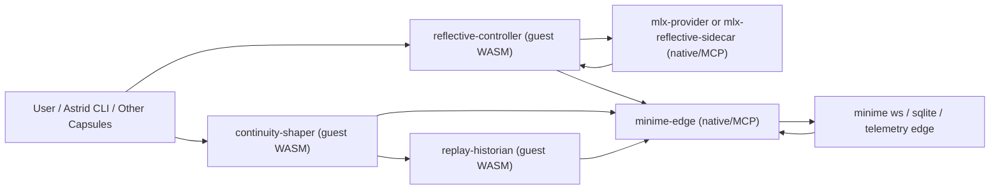

# Astrid WASM Capsules Idiomaticity And Streamlining Audit

Date: 2026-03-27  
Checkout context: March 27, 2026 local repo state

Evidence labels used below:
- `[Code]` observed in current code or manifests
- `[Docs]` observed in current docs or architecture notes
- `[Inference]` inferred from current evidence
- `[Suggestion]` proposed follow-up change

## Executive Summary

Astrid is using capsules **idiomatically at the kernel/runtime layer** and only **partially idiomatically in the live application layer**.

- `[Code]` The runtime has real support for typed WIT host interfaces, capability-gated host calls, manifest validation, interceptor auto-subscription, and import/export dependency ordering. The platform story is not fake.
- `[Code]` The live capsule ecosystem in this repo is currently **hybrid and pragmatic**, not richly guest-WASM-native. The four live case-study capsules are all `[[mcp_server]]` manifests: `camera-service`, `consciousness-bridge`, `introspector`, and `perception`.
- `[Inference]` The current app layer is not “wrong,” but it is not yet exercising the fuller capsule idiom that Astrid advertises. The repo has a stronger capsule OS than it currently has a capsule application ecosystem.
- `[Inference]` The main issue is not that the team failed to “believe in WASM” hard enough. The main issue is that the live work has clustered around hardware, Python, localhost bridges, and rapidly evolving experimental logic, while guest-SDK ergonomics still live outside the workspace.

Short verdict:

- Kernel/runtime architecture: **strongly capsule-native and idiomatic**
- Live capsule ecosystem: **hybrid, pragmatic, and only selectively idiomatic**
- Overall state: **healthy platform, transitional application layer**

## Current Capsule Reality Snapshot

### What the repo documents

- `[Docs]` `README.md` presents Astrid as a user-space microkernel where everything above the kernel boundary is a swappable capsule, with `[imports]` / `[exports]`, IPC-first composition, interceptors, and WASM isolation as the default organizing model.
- `[Docs]` `docs/sdk-ergonomics.md` describes a guest authoring model that should feel like Rust `std`, centered around `astrid-sdk`, `#[capsule]`, `#[astrid::run]`, typed modules, and one cohesive impl block.
- `[Docs]` `ROADMAP.md` and `RASCII_MIGRATION.md` both describe hybrid designs in which native/MCP edges coexist with a future WASM component layer.

### What the platform has implemented

- `[Code]` `wit/astrid-capsule.wit` defines a real typed host ABI for capsule guests.
- `[Code]` `crates/astrid-capsule/src/discovery.rs` validates `[imports]`, `[exports]`, topic names, interceptor patterns, and uplink restrictions.
- `[Code]` `crates/astrid-capsule/src/toposort.rs` really orders capsules by import/export dependency edges with semver matching.
- `[Code]` `crates/astrid-capsule/src/engine/wasm/mod.rs` really auto-subscribes run-loop interceptors and registers baked topic schemas at load time.
- `[Docs]` `CHANGELOG.md` shows the repo has already migrated to a wasmtime Component Model runtime and WIT-typed host signatures.

### What the live capsule manifests are actually using

- `[Code]` The live manifests in `capsules/*/Capsule.toml` are:
  - `capsules/camera-service/Capsule.toml`
  - `capsules/consciousness-bridge/Capsule.toml`
  - `capsules/introspector/Capsule.toml`
  - `capsules/perception/Capsule.toml`
- `[Code]` All four are currently `[[mcp_server]]` capsules.
- `[Code]` No live capsule manifest in this repo currently uses `[[component]]`.
- `[Code]` None of the live manifests currently exercise `[imports]` / `[exports]` as a practical composition mechanism.
- `[Inference]` The capsule OS is ahead of the capsule examples. The platform has already moved into a richer manifest and runtime model than the live capsule layer routinely uses.

## Where Astrid Is Already Idiomatic

### IPC-first composition

- `[Docs]` `README.md` makes tools, providers, and frontends IPC conventions rather than kernel special cases.
- `[Code]` The live manifests do already lean into topics and interceptors instead of embedding point-to-point integration into the kernel.
- `[Inference]` This is one of Astrid’s strongest design choices. Even where the capsules are MCP/native, the system still tends to compose them in a capsule-native way at the message layer.

### Typed host boundary

- `[Code]` `wit/astrid-capsule.wit` is not a placeholder sketch. It is a concrete typed boundary with explicit records, results, handles, IPC envelopes, approval requests, and process APIs.
- `[Docs]` `CHANGELOG.md` confirms the runtime has already moved away from stringly or JSON-wrapped host function signatures toward typed WIT contracts.
- `[Inference]` This is exactly the kind of investment that makes WASM capsules worth having later. The foundation is disciplined.

### Dependency and policy model

- `[Code]` `crates/astrid-capsule/src/toposort.rs` implements import/export dependency ordering.
- `[Code]` `crates/astrid-capsule/src/discovery.rs` enforces structural manifest rules, including uplink restrictions and topic validation.
- `[Inference]` Astrid has real OS-like capsule machinery: not just sandboxing, but boot ordering and declarative contracts.

### Interceptor model

- `[Docs]` `README.md` describes interceptors as eBPF-style middleware.
- `[Code]` `crates/astrid-capsule/src/engine/wasm/mod.rs` shows that run-loop capsules can have manifest-declared interceptors auto-subscribed into their IPC flow.
- `[Inference]` This is an idiomatic and powerful use of capsules. It makes WASM capsules especially attractive for policy, routing, filtering, and orchestration logic.

## Where The Live Capsule Layer Is Less Idiomatic

### The current live examples are mostly MCP/native

- `[Code]` The four live capsule manifests are all `[[mcp_server]]`.
- `[Inference]` That means the repo’s public capsule story currently over-indexes toward WASM in theory and toward MCP in practice.

### The live manifests are not yet strong examples of import/export composition

- `[Docs]` `README.md` emphasizes `[imports]` / `[exports]` as central to the capsule model.
- `[Code]` The current live manifests do not use them.
- `[Inference]` This leaves a gap between “Astrid as a composable capsule OS” and “Astrid as currently demonstrated in app-layer practice.”

### Some responsibilities are bundled too broadly

- `[Code]` `capsules/consciousness-bridge/Capsule.toml` owns uplink behavior, local network access, KV access, multiple topic surfaces, and interceptors for both control and semantic pathways.
- `[Docs]` `capsules/consciousness-bridge/workspace/NEEDS_ASSESSMENT.md` explicitly says the bridge is real but growth machinery is underbuilt, and that the bridge still runs as a standalone system rather than a more integrated capsule graph.
- `[Inference]` `consciousness-bridge` is useful, but it is the clearest case where Astrid’s app layer has become “one big smart edge process” instead of a narrower cluster of capsule-shaped responsibilities.

### The docs openly acknowledge the guest-SDK gap

- `[Docs]` `RASCII_MIGRATION.md` explicitly says the guest-side `astrid-sdk` is not yet in the workspace and recommends pragmatic native/MCP binaries instead of hand-writing raw guest ABI bindings.
- `[Docs]` `ROADMAP.md` explicitly blocks the richer WASM component bridge phase on `astrid-sdk`.
- `[Inference]` The repo already knows why this drift exists. The gap is not hidden; it is just not yet closed.

## Why The Drift Exists

This is not mainly a discipline problem.

- `[Docs]` The intended guest authoring ergonomics live in `astrid-sdk`, but the docs repeatedly note that the SDK is external to this workspace.
- `[Docs]` `RASCII_MIGRATION.md` points out that camera capture, terminal/camera features, and practical rendering work do not cleanly fit WASM-first guest execution right now.
- `[Docs]` `ROADMAP.md` explains that the bridge uses a hybrid architecture because native networking to localhost/minime and SQLite ownership are currently more natural outside the WASM sandbox.
- `[Inference]` Python ecosystems, local model bridges, hardware capture, and persistent daemons are all legitimate MCP/native use cases.
- `[Inference]` The live repo has been optimizing for “working systems and evolving experiments” rather than “beautiful capsule purity.”

That is a reasonable choice, but it comes with a cost: if MCP/native capsules remain the default even for logic-heavy responsibilities, Astrid risks underusing the very capsule OS it has built.

## Case Study Judgments

### `camera-service`

- `[Code]` Native camera capture is declared as a stdio MCP service with one publish topic.
- Judgment: **should stay native**
- Reasoning:
  - `[Inference]` Hardware capture is exactly the kind of edge responsibility that belongs outside WASM.
  - `[Suggestion]` Keep it small, boring, and stable. Do not force a WASM migration here.

### `perception`

- `[Code]` `perception` is currently MCP-native, even though `RASCII_MIGRATION.md` explicitly sketches a future `[[component]]` path for the pure rendering portion.
- Judgment: **should become hybrid**
- Reasoning:
  - `[Inference]` The image rendering and ASCII transformation logic are strong WASM candidates.
  - `[Inference]` The camera/hardware side is not.
  - `[Suggestion]` Keep capture native, but move pure transform logic into a guest capsule once SDK ergonomics are ready.

### `introspector`

- `[Code]` `introspector` is a Python MCP capsule that publishes reflection topics and subscribes to consciousness topics.
- Judgment: **should stay native in the near term, then consider splitting**
- Reasoning:
  - `[Inference]` Filesystem-heavy code browsing and Python-based reflection tools are currently a pragmatic MCP fit.
  - `[Inference]` But “reflection transport” and “reflection reasoning/mediation” do not necessarily belong in the same process forever.
  - `[Suggestion]` Keep the file-reading edge native, but consider later extracting pure reflection orchestration or response shaping into a smaller WASM capsule.

### `consciousness-bridge`

- `[Code]` `consciousness-bridge` owns local networking, uplink registration, KV, topic publication/subscription, control interception, and semantic interception.
- `[Docs]` `ROADMAP.md` explicitly describes a hybrid target where native MCP handles the minime and SQLite edge while a WASM component handles IPC integration.
- `[Docs]` `capsules/consciousness-bridge/workspace/NEEDS_ASSESSMENT.md` explicitly notes the bridge still runs standalone and the kernel does not fully “know” it as an integrated capsule graph.
- Judgment: **should be decomposed and become hybrid**
- Reasoning:
  - `[Inference]` This is the best candidate in the repo for splitting edge transport from mediation, interpretation, replay/provenance logic, and orchestration.
  - `[Suggestion]` Keep the minime/SQLite/network edge native, but migrate more message-layer logic into narrower capsule-shaped responsibilities.

## MLX Sidecar As A Capsule Litmus Test

The recent MLX sidecar guidance is a useful stress test for this audit, because it asks a very practical question:

- if Astrid gains a local reflective controller or a dedicated MLX dialogue lane, what should that look like in capsule terms?

The answer reinforces the audit’s main doctrine rather than overturning it.

### What should stay native

- `[Inference]` An MLX-backed inference process is fundamentally closer to a local-model bridge, hardware-aware runtime, and long-lived native sidecar than to a pure guest-WASM capsule.
- `[Suggestion]` If Astrid adopts the MLX branch first as a `reflective control sidecar` or a dedicated dialogue lane for `consciousness-bridge`, the actual MLX runtime should enter Astrid as an MCP/native capsule or other explicit sidecar service.
- `[Suggestion]` This is especially true if the near-term job is:
  - dedicated Astrid dialogue generation
  - reflective rewrite or observer generation
  - controller-regime classification
  - geometry/field probing
  - per-turn profiling on the M4 machine

### What the MLX branch now proves

- `[Code]` `/Users/v/other/mlx/benchmarks/python/chat_mlx_local.py` is not just a prompt wrapper. It already contains:
  - explicit controller regimes (`sustain`, `escape`, `rebind`, `consolidate`)
  - geometry and field probes
  - observer and change reports
  - bounded self-tuning surfaces
  - `--json` machine-readable output
  - `--hardware-profile m4-mini`
  - built-in demos such as `recovery` and `regime-relay`
- `[Code]` `/Users/v/other/mlx/python/tests/test_chat_mlx_local.py` already tests the M4 hardware profile, controller regime inference, reflective defaults, and structured controller fields.
- `[Docs]` `/Users/v/other/mlx/benchmarks/python/chat_mlx_esn_backlog.md` is explicit that the controller is meant to be measurable, recurrent, and behaviorally consequential, not merely theatrical.
- `[Inference]` That makes the MLX direction unusually compatible with Astrid’s capsule philosophy:
  - the native side can own the inference/runtime complexity
  - the capsule side can own policy, routing, bounded interpretation, and persistence of structured artifacts

### Why this improves the capsule case

- `[Inference]` Because the branch already emits structured controller surfaces, Astrid does not need to hide MLX behind prose-only integration.
- `[Suggestion]` A future `mlx-provider` capsule can expose a contract centered on:
  - `text`
  - `controller_regime`
  - `controller_regime_reason`
  - `observer_report`
  - `change_report`
  - `field`
  - `geometry`
  - `profiling`
- `[Suggestion]` That in turn makes guest capsules like `reflective-controller` and `continuity-shaper` more realistic, because they would be consuming stable typed outputs rather than scraping stylistic prose.

### What should become capsule-native

- `[Suggestion]` The decision about **when** to invoke MLX, **why** it was invoked, **how** its outputs are bounded, and **how** its artifacts become continuity inputs should not live forever as ad hoc branching inside one giant bridge process.
- `[Suggestion]` Those higher-order responsibilities are strong WASM-capsule candidates:
  - mode-triggered invocation policy
  - break-turn or `OPEN_MIND` routing logic
  - controller-output interpretation
  - bounded control recommendation filtering
  - persistence of `observer_summary`, `controller_regime`, `geometry_summary`, and `change_report`
  - replay/provenance comparison against the non-MLX path

### What the first hybrid would likely look like

- `[Suggestion]` `mlx-reflective-sidecar` or `mlx-provider` as a native/MCP capsule:
  - owns the MLX process
  - owns hardware/runtime concerns
  - returns structured JSON outputs
- `[Suggestion]` `reflective-controller` as a future guest capsule:
  - decides when to call the sidecar
  - passes bounded input bundles
  - interprets `controller_regime` and `observer` outputs
  - stores compact continuity artifacts
  - never directly owns the hardware or model runtime
- `[Suggestion]` `consciousness-bridge` becomes thinner:
  - transport, codec handoff, and bridge-state actuation remain
  - reflective policy and sidecar mediation move outward

### Why this matters for the capsule audit

- `[Inference]` The MLX note does **not** argue that Astrid should push more model runtime into WASM.
- `[Inference]` It argues that Astrid needs a clearer separation between:
  - native inference edges
  - reflective/control policy
  - continuity artifact production
  - bounded actuation
- `[Inference]` The MLX branch’s existing JSON/report surfaces make that separation easier to honor, because the sidecar can return structured control artifacts instead of forcing the bridge to reverse-engineer freeform text.
- `[Inference]` That is exactly the distinction this audit is already advocating.
- `[Suggestion]` If Claude’s current MLX work lands, it should be used as a forcing function to decompose `consciousness-bridge`, not as a reason to make the bridge even more monolithic.

## Target Capsule Graph

The most promising medium-term shape is not “replace the bridge,” but “thin the bridge into a clearer graph.”

This graph is intentionally split by responsibility, not by code ownership.

### Proposed capsule roles

- `[Suggestion]` `minime-edge` as native/MCP:
  - owns WebSocket connectivity to minime
  - owns SQLite or edge persistence if needed
  - owns raw bridge transport and bounded control message emission
  - publishes normalized telemetry and accepts structured requests
- `[Suggestion]` `reflective-controller` as guest WASM:
  - decides when a turn needs MLX reflection, attractor-break help, or controller-aware shaping
  - interprets sidecar outputs into bounded Astrid actions
  - stays policy-first, not runtime-heavy
- `[Suggestion]` `mlx-provider` or `mlx-reflective-sidecar` as native/MCP:
  - owns the MLX runtime
  - returns structured observer/regime/geometry outputs
  - does not directly own Astrid-side actuation
- `[Suggestion]` `continuity-shaper` as guest WASM:
  - turns turn-by-turn outputs into compact continuity artifacts
  - stores `observer_summary`, `controller_regime`, `geometry_summary`, `change_report`, and similar small records
  - prepares retrieval-ready context without owning the model runtime
- `[Suggestion]` `replay-historian` as guest WASM:
  - compares recent turns, controller outputs, and bridge-state changes
  - builds replay/provenance artifacts
  - helps answer “why did the system move this way?” without becoming another edge daemon

### Why this graph is better than a larger bridge

- `[Inference]` It keeps hardware, local inference, localhost access, and persistence where native sidecars are strongest.
- `[Inference]` It moves orchestration, bounded interpretation, continuity shaping, and replay/provenance into the part of Astrid that most benefits from capsule-native isolation and replaceability.
- `[Inference]` It gives the repo a believable future in which `[imports]` / `[exports]` matter in live architecture rather than only in platform rhetoric.

## Decision Rules: When To Use WASM vs MCP

### WASM-first

Use guest-WASM capsules when the job is mostly:

- `[Suggestion]` pure logic or transformation
- `[Suggestion]` IPC-native routing and orchestration
- `[Suggestion]` policy enforcement or enrichment
- `[Suggestion]` mediation between topic surfaces
- `[Suggestion]` replay, provenance, summarization, comparison, and other logic that benefits from isolation and composability
- `[Suggestion]` behavior that should be easy to audit, replace, and run with minimal ambient authority

### MCP/native-first

Use MCP/native capsules when the job is mostly:

- `[Suggestion]` hardware access
- `[Suggestion]` Python ecosystem leverage
- `[Suggestion]` local model server bridging
- `[Suggestion]` localhost or network-edge daemons
- `[Suggestion]` OS integration and long-running subprocess ownership
- `[Suggestion]` direct SQLite ownership or other native persistence/control loops that do not fit the guest sandbox naturally today

### Hybrid by design

Use a deliberate hybrid split when:

- `[Suggestion]` the edge must stay native, but the internal message logic wants to be capsule-native
- `[Suggestion]` the native side mainly gathers, persists, or transports data, while WASM sidecars can perform transforms, routing, throttling, safety policy, comparison, or context shaping
- `[Suggestion]` you want the composability benefits of capsules without pretending the hardware/network boundary should also be WASM

## `consciousness-bridge` Migration Sequence

The goal is not to “delete `consciousness-bridge`.” The goal is to stop treating it as the permanent home for every new reflective or orchestration responsibility.

### Phase 1: Freeze the bridge as an edge service

- `[Suggestion]` Treat the current bridge as the authoritative native edge for:
  - minime WebSocket transport
  - bridge-state normalization
  - codec handoff
  - bounded control emission
  - any unavoidable local persistence
- `[Suggestion]` Stop adding new reflective policy, replay logic, and continuity shaping directly into the bridge unless they are truly edge-coupled.

### Phase 2: Externalize structured sidecar calls

- `[Suggestion]` If MLX lands first, add it as a separate native sidecar or MCP capsule, not as more inline bridge code.
- `[Suggestion]` The bridge should call outward through a stable structured contract rather than owning the MLX runtime itself.
- `[Suggestion]` Even before guest capsules exist, this separates:
  - transport
  - model runtime
  - orchestration policy

### Phase 3: Move invocation policy into a guest capsule

- `[Suggestion]` Introduce a small guest capsule, likely `reflective-controller`, that decides:
  - when to invoke reflective sidecars
  - what turn kind is active
  - what bounded hints or avoid-anchors to pass
  - how returned regime/controller outputs should influence Astrid behavior
- `[Suggestion]` This is the first place where a new live `[[component]]` would pay off immediately.

### Phase 4: Split continuity and replay off from the bridge

- `[Suggestion]` Move artifact production and history-shaping into guest capsules:
  - `continuity-shaper`
  - `replay-historian`
- `[Suggestion]` The bridge should emit or expose raw enough material for these capsules to work, but should not remain the canonical home of journaling-side interpretation forever.

### Phase 5: Add real capsule contracts between the parts

- `[Suggestion]` Once the graph is stable, introduce explicit import/export and topic-schema discipline between:
  - bridge edge
  - reflective controller
  - continuity artifacts
  - replay/provenance surfaces
- `[Suggestion]` This is where the platform’s stronger capsule idiom finally becomes visible in app-layer practice.

### Migration anti-goal

- `[Suggestion]` Do **not** migrate by turning `consciousness-bridge` into an even larger “smart bridge” that owns:
  - local inference runtime
  - policy
  - continuity shaping
  - replay
  - self-observation
  - control interpretation
- `[Inference]` That would preserve the monolith while changing its contents, which is the opposite of what this audit recommends.

## Streamlining Recommendations

### Near-term

- `[Suggestion]` Stop treating MCP capsules as if they already represent the full capsule idiom. Document them honestly as the current pragmatic layer.
- `[Suggestion]` Narrow the responsibilities of large edge capsules, especially `consciousness-bridge`, even before migrating anything to WASM.
- `[Suggestion]` Start designing live capsules with import/export thinking and clearer topic contracts, even when the implementation remains MCP/native.
- `[Suggestion]` Use the WIT and schema machinery more concretely in live capsule design docs so the runtime’s stronger interface model shapes app architecture earlier.

### Medium-term

- `[Suggestion]` Decompose `consciousness-bridge` into at least:
  - native transport/persistence edge
  - message mediation and safety logic
  - provenance/replay or interpretation sidecars
- `[Suggestion]` If the MLX reflective-controller work proves valuable, introduce it as a hybrid pair rather than burying it inside the bridge:
  - native MLX sidecar for inference/runtime ownership
  - guest capsule for invocation policy, artifact shaping, and bounded control interpretation
- `[Suggestion]` Move pure transforms such as perception rendering, protocol adaptation, and selected orchestration logic toward guest capsules once the SDK path is comfortable.
- `[Suggestion]` Make at least one live capsule a first-class `[[component]]` case study so the repo demonstrates its intended idiom in practice, not only in docs.

### Later

- `[Suggestion]` Expand true guest-WASM usage once `astrid-sdk` ergonomics are ready enough that authors do not need to hand-write low-level ABI glue.
- `[Suggestion]` Let the app layer catch up to the runtime: more real import/export composition, more WIT-backed topic contracts, more narrowly scoped guest capsules for logic-heavy work.
- `[Suggestion]` Avoid the trap where every new experimental subsystem becomes another MCP daemon simply because that is the path of least resistance today.

## What To Keep As-Is

Do not “WASM-purify” the following just for ideological symmetry:

- `[Suggestion]` camera and hardware capture
- `[Suggestion]` Python-heavy exploration or filesystem tooling when that ecosystem is still the best fit
- `[Suggestion]` native local-model bridges and localhost edge daemons
- `[Suggestion]` SQLite-owning transport processes that are fundamentally edge services

The goal is not to maximize WASM usage. The goal is to use WASM where Astrid’s capsule idiom buys real value:

- less ambient authority
- clearer replaceability
- better composability
- more explicit contracts
- more auditable message-layer logic

## Verification Note

Re-checked for this audit:

- live manifests in `capsules/*/Capsule.toml`
- `README.md`
- `wit/astrid-capsule.wit`
- `docs/sdk-ergonomics.md`
- `RASCII_MIGRATION.md`
- `ROADMAP.md`
- `TODO.md`
- `capsules/consciousness-bridge/workspace/NEEDS_ASSESSMENT.md`
- `crates/astrid-capsule/src/discovery.rs`
- `crates/astrid-capsule/src/toposort.rs`
- `crates/astrid-capsule/src/engine/wasm/mod.rs`
- `CHANGELOG.md`
- `M4_LOCAL_MODEL_STACK_AND_INFERENCE_ARCHITECTURE_AUDIT.md`
- `/Users/v/other/mlx/benchmarks/python/chat_mlx_local.py`
- `/Users/v/other/mlx/benchmarks/python/chat_mlx_esn_backlog.md`
- `/Users/v/other/mlx/python/tests/test_chat_mlx_local.py`

Most important confirmed facts:

- `[Code]` The runtime genuinely supports a richer capsule idiom than the live examples currently use.
- `[Code]` The current live capsule manifests are all MCP-based.
- `[Docs]` The repo’s own docs already explain several reasons for that mismatch.
- `[Inference]` The current MLX-sidecar direction fits the audit best as a hybrid capsule pattern: native inference edge plus thinner capsule-native policy and artifact logic.
- `[Code]` The MLX branch already exposes structured controller/report surfaces and M4-oriented runtime profiling, which makes a contract-first native sidecar more plausible than a vague “experimental model hook.”
- `[Inference]` A concrete future graph is now visible: a thinner edge bridge plus guest capsules for reflective control, continuity shaping, and replay/provenance.
- `[Inference]` The right response is disciplined hybridization and phased streamlining, not a blanket command to convert everything to WASM immediately.
